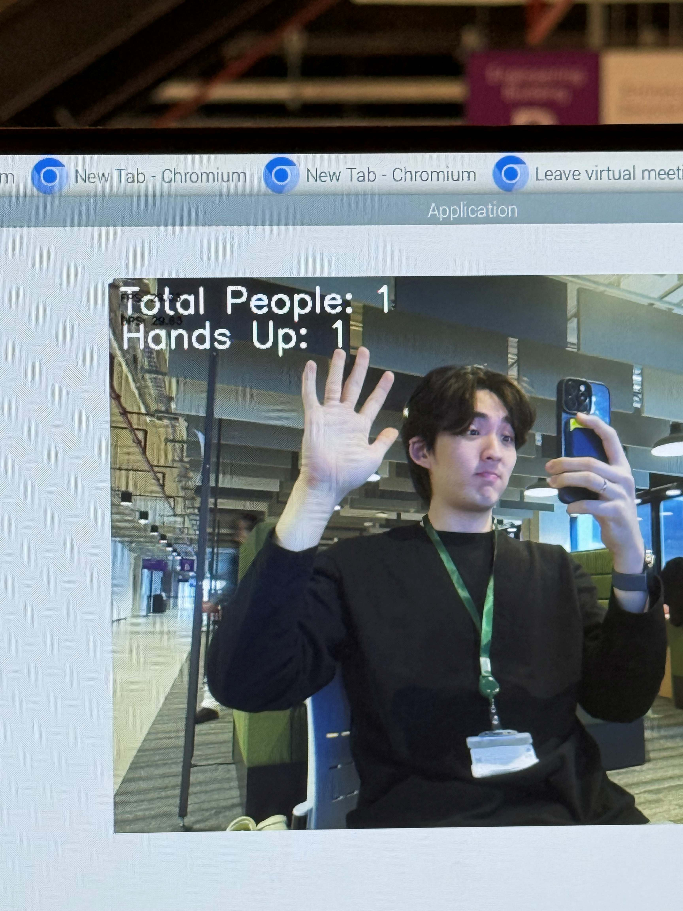

<h1 align='center'><b>Application Module Library</b></h1>
<p align='center'>
Application Module Library (modlib) is an SDK designed to simplify and streamline the process of creating <b>end-to-end</b> applications for the <b>IMX500 vision sensor</b>.
</p>

## Project Demo

<p align='center'>
    
</p>

<p align='center'>
    <a href="https://youtube.com/shorts/Sxucuh2GTYQ?feature=share"><b>Watch AI Camera Demo Video</b></a>
</p>

## 1. Development environment setup.
```
make setup
```

> Unit-tests are included in the corresponding `/tests` folder and can be exectued by running:
> `make test`  
> This also generates a corresponding coverage report.
>
> Linting corrections and checks (black, isort & flake8) by running:
> `make lint`

## 2. Building the Python wheel.
One can create a wheel file of the Application Module Library by running:
```
make build
```
The generated wheel file located in the `/dist` folder can be used to install the library in you project environment.
Your virtual environment has some prerequisites and should enable system-site-packages. Example:
1. Ensure that your Raspberry Pi runs the latest software:
```
sudo apt update && sudo apt full-upgrade
sudo apt install imx500-all
sudo apt install python3-opencv python3-munkres python3-picamera2
```
Reboot if needed.

2. Create your project virtual environment and install modlib.
```
python -m venv .venv --system-site-packages
. .venv/bin/activate
pip install modlib-<version>-py3-none-any.whl
```

## Basic example

As a basic example let's demonstrate the usage of the Raspberry Pi AiCamera device using a pre-trained SSDMobileNetV2FPNLite320x320 model.
Create a new file `hello_world.py` with the following content.


```python title="hello_world.py"
from modlib.apps import Annotator
from modlib.devices import AiCamera
from modlib.models.zoo import SSDMobileNetV2FPNLite320x320

device = AiCamera()
model = SSDMobileNetV2FPNLite320x320()
device.deploy(model)

annotator = Annotator(thickness=1, text_thickness=1, text_scale=0.4)

with device as stream:
    for frame in stream:
        detections = frame.detections[frame.detections.confidence > 0.55]
        labels = [f"{model.labels[class_id]}: {score:0.2f}" for _, score, class_id, _ in detections]
        
        annotator.annotate_boxes(frame, detections, labels=labels)
        frame.display()
```

3. Run the example, and make sure the Application Module Library is installed in your environment.

```
. .venv/bin/activate && python hello_world.py
```

Note that the Application Module Library API allows you to create custom Models and combine any network.rpk with your own custom post_processing function. More information in `docs > getting_started > custom_models.md`.

## Releases

Release tags must be of the format "\d+\.\d+\.\d+" example "1.0.4".

## License

[LICENSE](./LICENSE)

## Notice

Sony Semiconductor Solutions Corporation assumes no responsibility for applications created using this library. Use of the library is entirely at the user's own risk.

### Security

Please read the Site Policy of GitHub and understand the usage conditions.